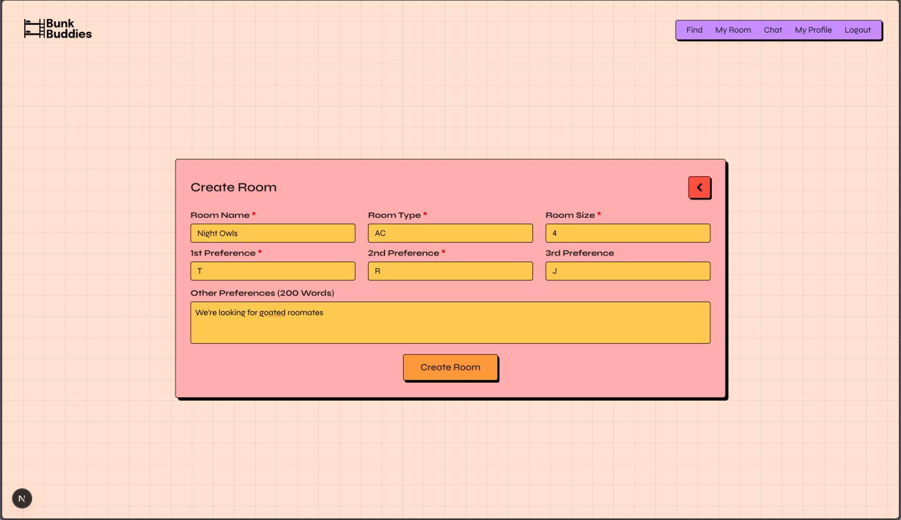
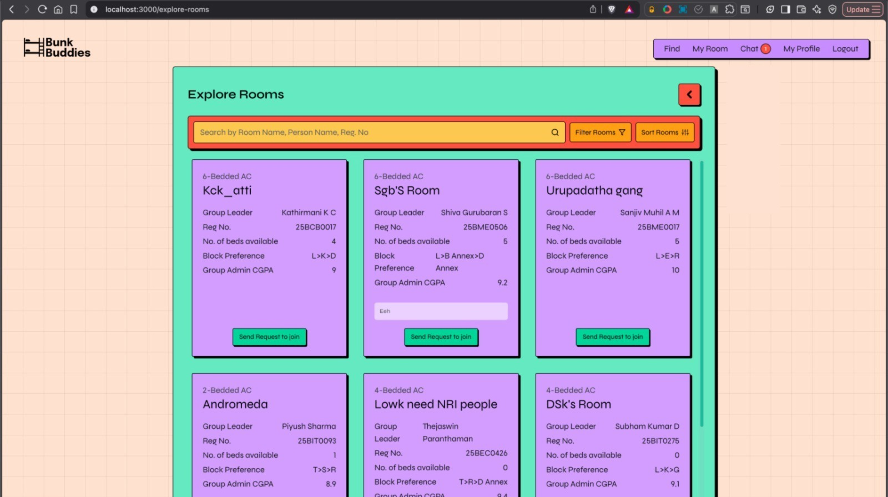

<a id="readme-top"></a>


<!-- Club Logo -->
<br />
<div align="center">
  <a href="https://github.com/vinnovateit/BunkBuddies-Backend">
    <picture>
      <source media="(prefers-color-scheme: dark)" srcset="https://raw.githubusercontent.com/vinnovateit/.github/main/assets/whiteLogoViit.svg">
      
    </picture>
  </a>

<h3 align="center">BunkBuddies</h3>

  <p align="center">
    Web application for finding roomates during VIT hostel counselling
    <br />
    <br />
    <br />
    <a href="https://github.com/vinnovateit/BunkBuddies-Backend">Visit</a>
    &middot;
    <a href="https://github.com/vinnovateit/BunkBuddies-Backend/issues/new?labels=bug&template=bug-report---.md">Report Bug</a>
    &middot;
    <a href="https://github.com/vinnovateit/BunkBuddies-Backend/issues/new?labels=enhancement&template=feature-request---.md">Request Feature</a>
  </p>
</div>


<!-- TABLE OF CONTENTS -->
<!-- Use if things get too long -->
<!-- <details>
  <summary>Table of Contents</summary>
  <ol>
    <li>
      <a href="#about-the-project">About The Project</a>
      <ul>
        <li><a href="#built-with">Built With</a></li>
      </ul>
    </li>
    <li><a href="#roadmap">Roadmap</a></li>
    <li>
      <a href="#getting-started">Getting Started</a>
      <ul>
        <li><a href="#prerequisites">Prerequisites</a></li>
        <li><a href="#installation">Installation</a></li>
      </ul>
    </li>
    <li><a href="#usage">Usage</a></li>
    <li><a href="#acknowledgments">Acknowledgments</a></li>
  </ol>
</details> -->


<!-- ABOUT THE PROJECT -->
## About The Project

<!-- Put the PROJECT LOGO here -->
<picture>
  <source media="(prefers-color-scheme: dark)" srcset=".github/assets/bb_logo_white.svg">
  
</picture>


BunkBuddies is a web application developed by VinnovateIT that helps in selecting roommate for VIT hostel counseling. It leverages Natural Language Processing to generate compatibility scores and rank potential roommates. It features private and public chats to facilitate seamless communication between VIT students.

<!-- Put appropriate SCREENSHOTS here
Use width modifier to control size
Use wisely: don't overfill & don't use too heavy imgs
-->
<details>
  <summary><b>Screenshots</b></summary>
  
  | Dashboard | Create Room |
  | :--------------: | :--------: |
  |  |  |
  | **Explore Rooms** | **Chat** |
  |  |  |

</details>


### Core Features

- Google sign-in flow through `/api/login` and `/api/auth/callback/google`
- Session-aware routing with onboarding redirects
- Personality quiz for hostel type, hostel group, rank, sleep schedule, cleanliness, social habits, languages, and personal description
- Profile creation and editing with VIT student details
- Room group creation, editing, deletion, joining by room code, and leaving
- Room exploration with search, filters, sorting, pagination, vacancy details, and join requests
- Group dashboard with squad details, compatibility badges, request approval/rejection, invite code generation, and member removal
- Real-time hostel chat and direct messages through WebSockets
- Custom 404 page, toast notifications, contributor showcase, and responsive VinnovateIT-themed UI

### Built With

[![Next][Next.js]][Next-url]
[![React][React.js]][React-url]
[![Tailwind][Tailwind.css]][Tailwind-url]
[![Cloudflare][Cloudflare]][Cloudflare-url]
[![OpenNext][OpenNext]][OpenNext-url]
[![ESLint][ESLint]][ESLint-url]

## Project Structure

```text
BunkBuddies-Frontend/
|-- public/                         # Logos, icons, contributor images, decorative assets
|-- src/
|   |-- app/
|   |   |-- api/                    # Frontend auth/session/backend proxy routes
|   |   |-- chat/                   # Hostel chat and direct messaging
|   |   |-- create-room/            # Room create/edit flow
|   |   |-- explore-rooms/          # Room discovery, search, filters, requests
|   |   |-- find-buddies/           # Main post-login action dashboard
|   |   |-- my-groups/              # Current group, join requests, invite codes
|   |   |-- personality-quiz/       # Onboarding quiz
|   |   |-- profile/                # Student profile form
|   |   |-- signin/                 # Google sign-in screen
|   |   |-- thankyou/               # Thank-you/sign-off page
|   |   |-- components/             # Shared UI components
|   |   |-- utils/                  # Backend client and data helpers
|   |   |-- globals.css
|   |   |-- layout.js
|   |   `-- page.js
|-- open-next.config.ts             # OpenNext Cloudflare config
|-- wrangler.jsonc                  # Cloudflare Workers deployment config
|-- next.config.mjs
|-- package.json
`-- .env.example
```

## Routes

| Route | Purpose |
| --- | --- |
| `/` | Landing page with product pitch, how-it-works section, contributors, and footer |
| `/signin` | Google sign-in entry page |
| `/thankyou` | Thank-you/sign-off page shown from the landing CTA |
| `/personality-quiz` | Student onboarding quiz |
| `/profile` | Student profile creation/editing |
| `/find-buddies` | Main dashboard for creating, exploring, joining rooms, and opening chat |
| `/create-room` | Create or edit a room group |
| `/explore-rooms` | Browse available room groups and send join requests |
| `/my-groups` | Manage the user's current group, invite code, members, and join requests |
| `/chat` | Hostel-wide chat and direct messages |

## Frontend API Routes

| Route | Method | Description |
| --- | --- | --- |
| `/api/login` | `GET` | Starts backend Google OAuth and redirects to Google |
| `/api/auth/callback/google` | `GET` | Completes OAuth, stores `bb_access_token`, and redirects based on user state |
| `/api/auth/session` | `GET` | Checks current auth/profile/quiz/group state |
| `/api/logout` | `POST` | Clears the auth cookie |
| `/api/backend/[...path]` | `GET`, `POST`, `PUT`, `PATCH`, `DELETE` | Authenticated proxy to backend endpoints |

## Getting Started

Follow these steps to run the frontend locally.

### Prerequisites

- Node.js 18.18 or newer recommended for Next.js 15
- npm
- A running BunkBuddies backend service
- Backend Google OAuth configured with this frontend callback URL:

```text
http://localhost:3000/api/auth/callback/google
```

### Installation

1. Clone the repository

   ```sh
   git clone https://github.com/Rishi-Heda/BunkBuddies-Frontend.git
   cd BunkBuddies-Frontend
   ```

2. Install dependencies

   ```sh
   npm install
   ```

3. Create a local environment file

   ```sh
   cp .env.example .env.local
   ```

4. Configure environment variables

   ```env
   BACKEND_API_URL=http://localhost:8000
   NEXT_PUBLIC_BACKEND_API_URL=http://localhost:8000
   NEXT_PUBLIC_WS_URL=ws://localhost:8000
   ```

5. Start the development server

   ```sh
   npm run dev
   ```

6. Open the app

   ```text
   http://localhost:3000
   ```

## Environment Variables

| Variable | Required | Used By | Description |
| --- | --- | --- | --- |
| `BACKEND_API_URL` | Yes | Server/API routes | Backend HTTP base URL used by auth, session, and proxy routes |
| `NEXT_PUBLIC_BACKEND_API_URL` | Yes | Fallback/client-visible config | Public fallback for backend HTTP base URL |
| `NEXT_PUBLIC_WS_URL` | Yes for chat | `/chat` | WebSocket base URL for hostel chat and direct messages |

The app falls back to `http://localhost:8000` for backend HTTP requests and `ws://localhost:8000` for WebSockets when variables are not set.

## Available Scripts

| Command | Description |
| --- | --- |
| `npm run dev` | Runs the Next.js development server with Turbopack |
| `npm run build` | Creates a production Next.js build |
| `npm run start` | Starts the production Next.js server |
| `npm run lint` | Runs the configured Next.js lint command |
| `npm run preview` | Builds with OpenNext and previews on Cloudflare locally |
| `npm run deploy` | Builds with OpenNext and deploys to Cloudflare |
| `npm run cf-typegen` | Generates Cloudflare environment TypeScript bindings |

## Deployment

This project is configured for Cloudflare Workers through OpenNext.

- `open-next.config.ts` defines the OpenNext Cloudflare adapter configuration.
- `wrangler.jsonc` points Cloudflare to `.open-next/worker.js`.
- Static assets are served from `.open-next/assets`.
- `nodejs_compat` is enabled for the Worker runtime.

To preview or deploy:

```sh
npm run preview
npm run deploy
```

## Backend Integration

The frontend expects the backend to expose endpoints for:

- Google OAuth login and callback
- Student profile fetch/update
- Group create/update/delete/leave/join-code flows
- Group listing, filtering, and join requests
- Direct message contacts and history
- General chat history
- WebSocket endpoints for `/generalChat/ws/:regNo` and `/dm/ws/:regNo`

Authenticated frontend calls should use `backendFetch()` from `src/app/utils/backendClient.js`, which sends requests through `/api/backend` so the HTTP-only `bb_access_token` cookie can be attached server-side.

## Contributors

<a href="https://github.com/Rishi-Heda/BunkBuddies-Frontend/graphs/contributors">
  
</a>

## Acknowledgments

- [VinnovateIT Family](https://vinnovateit.com) for mentoring and resources
- A huge thank you to the open-source community behind the core stack: [Next.js](https://nextjs.org/), [React](https://react.dev/), [Tailwind CSS](https://tailwindcss.com/), [Cloudflare Workers](https://developers.cloudflare.com/workers/), [ESLint](https://eslint.org/) & [OpenNext](https://opennext.js.org/).

<p align="center">
	Made with :heart: by <a href="https://vinnovateit.com">VinnovateIT</a>
</p>


<!-- MARKDOWN LINKS & IMAGES -->
[Next.js]: https://img.shields.io/badge/next.js-000000?&logo=nextdotjs&logoColor=white
[Next-url]: https://nextjs.org/
[React.js]: https://img.shields.io/badge/React-20232A?&logo=react&logoColor=61DAFB
[React-url]: https://react.dev/
[Tailwind.css]: https://img.shields.io/badge/Tailwind_CSS-38B2AC?&logo=tailwind-css&logoColor=white
[Tailwind-url]: https://tailwindcss.com/
[Cloudflare]: https://img.shields.io/badge/Cloudflare-F38020?&logo=cloudflare&logoColor=white
[Cloudflare-url]: https://developers.cloudflare.com/workers/
[OpenNext]: https://img.shields.io/badge/OpenNext-111111?&logo=nextdotjs&logoColor=white
[OpenNext-url]: https://opennext.js.org/cloudflare
[ESLint]: https://img.shields.io/badge/ESLint-4B32C3?&logo=eslint&logoColor=white
[ESLint-url]: https://eslint.org/
